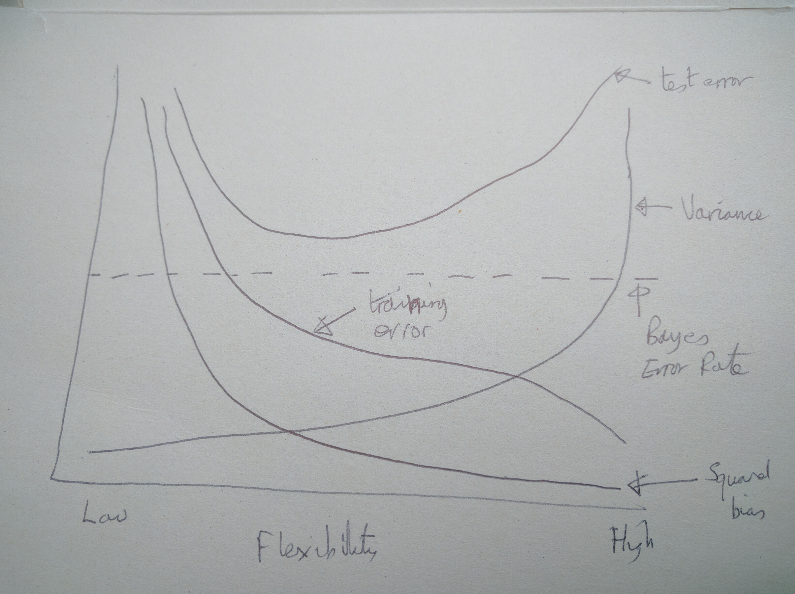
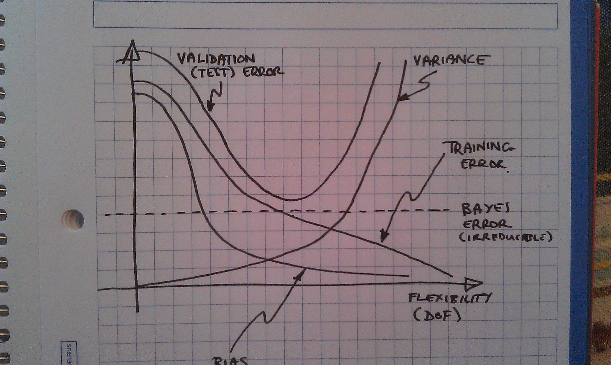

---
title: "Chapter Two Exercises"
author: "Chris Shaw"
date: "30 April 2016"
output: pdf_document
header-includes:
 - \input{answer.sty}
---

```{r setup, include=FALSE}
knitr::opts_chunk$set(echo = TRUE)
```


# Unofficial solutions

Somebody has documented solutions to all the exercises unoffically: [http://blog.princehonest.com/stat-learning/](http://blog.princehonest.com/stat-learning/)

My answers are in \color{blue}\texttt{blue }\normalcolor and the answers from the unofficial site are in \color{red}\texttt{red}\normalcolor.

# Conceptual

1. For each of parts (a) through (d), indicate whether we would generally
expect the performance of a flexible statistical learning method to be
better or worse than an inflexible method. Justify your answer.
(a) The sample size n is extremely large, and the number of predictors
p is small.
(b) The number of predictors p is extremely large, and the number
of observations n is small.
(c) The relationship between the predictors and response is highly
non-linear.
(d) The variance of the error terms, i.e. $\sigma^2$  = Var($\epsilon$), is extremely
high.


\begin{myanswer}
Flexible methods are those which allow a number of different functional forms $f$ to be applied to the input variables $X_1,...,X_p$ to model the output variable $Y$.

\cross
(a) If there are a large number $n$ of observations, then the inflexible method will perform better when the number of predictors $p$ is small.  This is because there is a danger of overfitting in an flexible model.  Moreover, the large number of observations will allow an accurate estimate of the small number of predictors with an inflexible model such as linear regression.


\cross
(b) don't know

\tick
(c) If the relationship between the predictors and the response is highly non-linear, then a flexible method will give better performance

\tick
(d) If the variance of the error term is high, this is likely to correlate with a flexible method.  So an inflexible method would be preferable to reduce the variance.


\end{myanswer}


\begin{theiranswer}
1. (a) better - a more flexible approach will fit the data closer and with the
large sample size a better fit than an inflexible approach would be obtained

(b) worse - a flexible method would overfit the small number of observations

(c) better - with more degrees of freedom, a flexible model would obtain a
better fit

(d) worse - flexible methods fit to the noise in the error terms and increase variance

\end{theiranswer}


\newpage

2. Explain whether each scenario is a classification or regression problem,
and indicate whether we are most interested in inference or prediction.
Finally, provide n and p.
(a) We collect a set of data on the top 500 firms in the US. For each firm we record profit, number of employees, industry and the
CEO salary. We are interested in understanding which factors
affect CEO salary.
(b) We are considering launching a new product and wish to know
whether it will be a success or a failure. We collect data on 20
similar products that were previously launched. For each product
we have recorded whether it was a success or failure, price
charged for the product, marketing budget, competition price,
and ten other variables.
(c) We are interesting in predicting the % change in the US dollar in
relation to the weekly changes in the world stock markets. Hence
we collect weekly data for all of 2012. For each week we record
the % change in the dollar, the % change in the US market,
the % change in the British market, and the % change in the
German market.


\begin{myanswer}
\tick
(a)  CEO salary is a continuous variable, so the problem is one of regression.  It is an inference problem because we are interested in which factors affect the salary.  $n$ is 500 (number of observations) and $p$ is 3 (number of variables which combine to produce the CEO salary)
 
\tick
(b)  The success of the project is categorical (success/fail) so this is a class\-ification problem.  It is a prediction problem because we just want to know the outcome, not the relationship between the predictors and the outcome.  $n$ is 20 and $p$ is 13.

\tick
(c)  This is a prediction problem because we just want the overall \% change.  It is a regression model because weekly \% change is a continuous variable.  $n$ is 52 (number of weeks in 2012) and $p$ is 3.

\end{myanswer}

\begin{theiranswer}
2. (a) regression. inference. quantitative output of CEO salary based on CEO
firm's features.
n - 500 firms in the US
p - profit, number of employees, industry

(b) classification. prediction. predicting new product's success or failure.
n - 20 similar products previously launched
p - price charged, marketing budget, comp. price, ten other variables

(c) regression. prediction. quantitative output of \% change
n - 52 weeks of 2012 weekly data
p - \% change in US market, \% change in British market, \% change in German market


\end{theiranswer}

3. We now revisit the bias-variance decomposition.
(a) Provide a sketch of typical (squared) bias, variance, training error,
test error, and Bayes (or irreducible) error curves, on a single
plot, as we go from less flexible statistical learning methods
towards more flexible approaches. The x-axis should represent
the amount of flexibility in the method, and the y-axis should
represent the values for each curve. There should be five curves.
Make sure to label each one.
(b) Explain why each of the five curves has the shape displayed in
part (a).


\begin{myanswer}
\tick
(a)  See above

\tick
(b)  Training error curve slopes downward because mor flexible methods allow the training set to be fitted with more accuracy.

\cross
The test error curve has a higher MSE in general, and it has a minimum value which is where the best model can be found.

\tick
The Bayes Error rate is the minimum irreducible error and does not depend on the underlying predictors

Variance is the amount by which $\hat f(x_0)$ changes if we use different training data $x_0$.  Bias is the error that is introduced by assuming a much simpler fit for $\hat f$ than is actually the case in practice.

\cross
Bias is higher when flexibility is lower and low when flexibility is high.  On the other hand, variance does not change much for inflexible models (one training data set is much the same as another), however this rises as the flexibility increases.

\end{myanswer}



\begin{theiranswer}
3. (a) See above.

(b) 
all 5 lines >= 0

i. (squared) bias - decreases monotonically because increases in flexibility
yield a closer fit

ii. variance - increases monotonically because increases in flexibility yield
overfit

iii. training error - decreases monotonically because increases in flexibility
yield a closer fit

iv. test error - concave up curve because increase in flexibility yields a closer
fit before it overfits

v. Bayes (irreducible) error - defines the lower limit, the test error is bounded 
below by the irreducible error due to variance in the error (epsilon) in the output 
values (0 <= value). When the training error is lower than the irreducible error,
overfitting has taken place.
The Bayes error rate is defined for classification problems and is determined by 
the ratio of data points which lie at the 'wrong' side of the decision boundary, 
(0 <= value < 1).

\end{theiranswer}

4. You will now think of some real-life applications for statistical learning.
(a) Describe three real-life applications in which classification might
be useful. Describe the response, as well as the predictors. Is the
goal of each application inference or prediction? Explain your
answer.
(b) Describe three real-life applications in which regression might
be useful. Describe the response, as well as the predictors. Is the
goal of each application inference or prediction? Explain your
answer.
(c) Describe three real-life applications in which cluster analysis
might be useful.

5. What are the advantages and disadvantages of a very flexible (versus
a less flexible) approach for regression or classification? Under what
circumstances might a more flexible approach be preferred to a less
flexible approach? When might a less flexible approach be preferred?

6. Describe the differences between a parametric and a non-parametric
statistical learning approach. What are the advantages of a parametric
approach to regression or classification (as opposed to a nonparametric
approach)? What are its disadvantages?

7. The table below provides a training data set containing six observations,
three predictors, and one qualitative response variable.
Obs. X1 X2 X3 Y
1     0  3 0 Red
2     2  0 0 Red
3     0  1 3 Red
4     0  1 2 Green
5    -1  0 1 Green
6     1 1 1 Red
Suppose we wish to use this data set to make a prediction for Y when
X1 = X2 = X3 = 0 using K-nearest neighbors.
(a) Compute the Euclidean distance between each observation and
the test point, X1 = X2 = X3 = 0.
54 2. Statistical Learning
(b) What is our prediction with K = 1? Why?
(c) What is our prediction with K = 3? Why?
(d) If the Bayes decision boundary in this problem is highly nonlinear,
then would we expect the best value for K to be large or
small? Why?

# Applied

8. This exercise relates to the College data set, which can be found in
the file College.csv. It contains a number of variables for 777 different
universities and colleges in the US. The variables are
* Private : Public/private indicator
* Apps : Number of applications received
* Accept : Number of applicants accepted
* Enroll : Number of new students enrolled
* Top10perc : New students from top 10% of high school class
* Top25perc : New students from top 25% of high school class
* F.Undergrad : Number of full-time undergraduates
* P.Undergrad : Number of part-time undergraduates
* Outstate : Out-of-state tuition
* Room.Board : Room and board costs
* Books : Estimated book costs
* Personal : Estimated personal spending
* PhD : Percent of faculty with Ph.D.’s
* Terminal : Percent of faculty with terminal degree
* S.F.Ratio : Student/faculty ratio
* perc.alumni : Percent of alumni who donate
* Expend : Instructional expenditure per student
* Grad.Rate : Graduation rate
Before reading the data into R, it can be viewed in Excel or a text
editor.
(a) Use the read.csv() function to read the data into R. Call the
loaded data college. Make sure that you have the directory set
to the correct location for the data.
(b) Look at the data using the fix() function. You should notice
that the first column is just the name of each university.We don’t
really want R to treat this as data. However, it may be handy to
have these names for later. Try the following commands:
```
> rownames (college )=college [,1]
> fix (college )
```
You should see that there is now a row.names column with the
name of each university recorded. This means that R has given
each row a name corresponding to the appropriate university. R
will not try to perform calculations on the row names. However,
we still need to eliminate the first column in the data where the
names are stored. Try
```
> college =college [,-1]
> fix (college )
```
Now you should see that the first data column is Private. Note
that another column labeled row.names now appears before the
Private column. However, this is not a data column but rather
the name that R is giving to each row.
(c) i. Use the summary() function to produce a numerical summary
of the variables in the data set.
ii. Use the pairs() function to produce a scatterplot matrix of
the first ten columns or variables of the data. Recall that
you can reference the first ten columns of a matrix A using
A[,1:10].
iii. Use the plot() function to produce side-by-side boxplots of
Outstate versus Private.
iv. Create a new qualitative variable, called Elite, by binning
the Top10perc variable. We are going to divide universities
into two groups based on whether or not the proportion
of students coming from the top 10% of their high school
classes exceeds 50%.
```
> Elite =rep ("No",nrow(college ))
> Elite [college$Top10perc >50]=" Yes"
> Elite =as.factor (Elite)
> college =data.frame(college ,Elite)
```
Use the summary() function to see how many elite universities
there are. Now use the plot() function to produce
side-by-side boxplots of Outstate versus Elite.
v. Use the hist() function to produce some histograms with
differing numbers of bins for a few of the quantitative variables.
You may find the command par(mfrow=c(2,2)) useful:
it will divide the print window into four regions so that four
plots can be made simultaneously. Modifying the arguments
to this function will divide the screen in other ways.
vi. Continue exploring the data, and provide a brief summary
of what you discover.

9. This exercise involves the Auto data set studied in the lab. Make sure
that the missing values have been removed from the data.
(a) Which of the predictors are quantitative, and which are qualitative?
(b) What is the range of each quantitative predictor? You can answer
this using the range() function.
range()
(c) What is the mean and standard deviation of each quantitative
predictor?
(d) Now remove the 10th through 85th observations. What is the
range, mean, and standard deviation of each predictor in the
subset of the data that remains?
(e) Using the full data set, investigate the predictors graphically,
using scatterplots or other tools of your choice. Create some plots
highlighting the relationships among the predictors. Comment
on your findings.
(f) Suppose that we wish to predict gas mileage (mpg) on the basis
of the other variables. Do your plots suggest that any of the
other variables might be useful in predicting mpg? Justify your
answer.

10. This exercise involves the Boston housing data set.
(a) To begin, load in the Boston data set. The Boston data set is
part of the MASS library in R.
```
> library (MASS)
```
Now the data set is contained in the object Boston.
```
> Boston
```
Read about the data set:
```
> ?Boston
```
How many rows are in this data set? How many columns? What
do the rows and columns represent?
(b) Make some pairwise scatterplots of the predictors (columns) in
this data set. Describe your findings.
(c) Are any of the predictors associated with per capita crime rate?
If so, explain the relationship.
(d) Do any of the suburbs of Boston appear to have particularly
high crime rates? Tax rates? Pupil-teacher ratios? Comment on
the range of each predictor.
(e) How many of the suburbs in this data set bound the Charles
river?
(f) What is the median pupil-teacher ratio among the towns in this
data set?
(g) Which suburb of Boston has lowest median value of owneroccupied
homes? What are the values of the other predictors
for that suburb, and how do those values compare to the overall
ranges for those predictors? Comment on your findings.
(h) In this data set, how many of the suburbs average more than
seven rooms per dwelling? More than eight rooms per dwelling?
Comment on the suburbs that average more than eight rooms
per dwelling