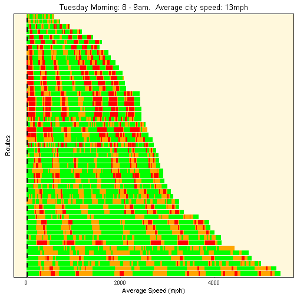

## Introduction

* Bristol has deployed multiple sensors around the city and made data available in an open data project (https://opendata.bristol.gov.uk/)
* One dataset collects journey times from 51 different routes, varying in length from r min(summary$distance_miles) to r max(summary$distance_miles) miles.  This data is collected every ten minutes, 24 hours a day, seven days a week.
* We introduce today a brand new application that makes use of the historical journey times data to build up a profile of average traffic conditions in Bristol for every hour in every day.
*  It's expected that this application will be used by commuters, small businesses and local government planners amongst others.
* The following slides demonstrate how the application works

---

## test


```
## PhantomJS not found. You can install it with webshot::install_phantomjs(). If it is installed, please make sure the phantomjs executable can be found via the PATH variable.
```

```
## Warning in normalizePath(path.expand(path), winslash, mustWork): path[1]=".
## \webshot2230c31416.png": The system cannot find the file specified
```

```
## Warning in file(con, "rb"): cannot open file 'C:\Users\cs\AppData\Local
## \Temp\RtmpiIjPhj\file223027f65e7\webshot2230c31416.png': No such file or
## directory
```

```
## Error in file(con, "rb"): cannot open the connection
```


---




---


--- 

## The input screen


```

---

